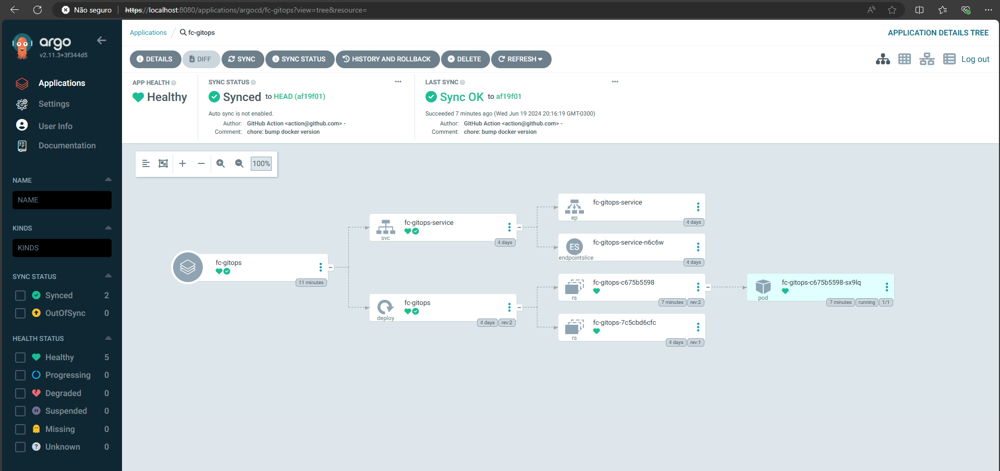

# FC GitOps

This repository contains the source code for the [Full Cycle course](https://fullcycle.com.br/certificado/3c5f7be8-1c3b-40de-8741-5749b7abd26e) I took to practice GitOps.

GitOps is a set of practices that use Git repositories as the single source of truth for declarative infrastructure and applications. It combines the benefits of Git's version control and collaboration features with automated deployment and operations processes.

## Key Concepts of GitOps

1. **Declarative descriptions**: use declarative configurations for infrastructure and applications.
2. **Single source of truth**: maintain these configurations in a Git repository.
3. **Automated synchronization**: automatically synchronize the desired state with the actual state.
4. **Pull-based deployments**: pull changes from the Git repository and apply them to the infrastructure.
5. **Version control and auditability**: leverage Git’s versioning to track changes and ensure auditability.

## Benefits of GitOps

1. **Consistency and reliability**: ensures that the deployed state matches the desired state as defined in Git.
2. **Enhanced collaboration**: facilitates collaboration through Git’s branching and pull request model.
3. **Improved security**: centralizes control over changes, reducing the risk of unauthorized modifications.
4. **Faster recovery**: allows for quick rollback to previous states in case of issues.
5. **Audit and compliance**: provides a clear history of changes, aiding compliance and audits.
6. **Scalability**: simplifies scaling operations across multiple environments and clusters.

## GitOps Workflow

1. **Define desired state**: use declarative files to describe the desired state of your infrastructure and applications.
2. **Create or update infrastructure**: commit and push changes to the Git repository.
3. **Automated deployment**: use automation tools to apply changes from the Git repository to the actual environment.
4. **Monitor and correct**: continuously monitor the environment and correct any drift from the desired state.

## Tools for GitOps

[Argo CD](https://argoproj.github.io/) is a declarative, GitOps continuous delivery tool for Kubernetes. Application definitions, configurations, and environments should be declarative and version-controlled. Application deployment and lifecycle management should be automated, auditable, and easy to understand.



GitOps leverages the strengths of Git for version control and collaboration to manage infrastructure and application deployments. By treating Git as the single source of truth and using automation to ensure the actual state matches the desired state, GitOps enhances consistency, reliability, and security in software operations.

## How the GitHub Actions Workflow and Kubernetes files work together

### GitHub Actions CI Pipeline

```yaml
name: GitOps Pipeline

on:
  push:
    branches: [develop, main]

env:
  DOCKERHUB_USERNAME: ${{ secrets.DOCKERHUB_USERNAME }}
  DOCKERHUB_TOKEN: ${{ secrets.DOCKERHUB_TOKEN }}

jobs:
  build:
    name: Build and Push Docker Image
    runs-on: ubuntu-latest
    permissions:
      contents: write
    steps:
      - name: Checkout
        uses: actions/checkout@v4
        with:
          fetch-depth: 0

      - name: Docker meta
        id: meta
        uses: docker/metadata-action@v5
        with:
          images: dalloglio/fc-gitops
          tags: type=sha,prefix={{branch}}-

      - name: Set up QEMU
        uses: docker/setup-qemu-action@v3

      - name: Set up Docker Buildx
        uses: docker/setup-buildx-action@v3

      - name: Login to Docker Hub
        uses: docker/login-action@v3
        with:
          username: ${{ env.DOCKERHUB_USERNAME }}
          password: ${{ env.DOCKERHUB_TOKEN }}

      - name: Build and Push
        uses: docker/build-push-action@v5
        with:
          push: true
          tags: ${{ steps.meta.outputs.tags }}
          labels: ${{ steps.meta.outputs.labels }}

      - name: Set up Kustomize
        uses: imranismail/setup-kustomize@v1
        with:
          kustomize-version: 3.6.1

      - name: Update Kubernetes resources
        env:
          DOCKERHUB_USERNAME: ${{ env.DOCKERHUB_USERNAME }}
        run: |
          cd k8s
          kustomize edit set image fc-gitops=$DOCKERHUB_USERNAME/fc-gitops:$DOCKER_METADATA_OUTPUT_VERSION

      - name: Git Commit
        run: |
          git config --local user.email "action@github.com"
          git config --local user.name "GitHub Action"
          git commit -am "chore: bump docker version"

      - name: Git Push
        uses: ad-m/github-push-action@master
        with:
          github_token: ${{ secrets.GITHUB_TOKEN }}
          repository: dalloglio/fc-gitops
          branch: ${{ github.ref }}
```

### Explanation of the workflow

1. **Build and push docker image**:

   - The workflow builds a new Docker image for the `fc-gitops` application using the latest code from the repository.
   - This image is then pushed to Docker Hub with tags and labels generated by the `docker/metadata-action`.

2. **Update Kubernetes manifests**:

   - After the Docker image is built and pushed, the workflow updates the `k8s/kustomization.yml` file to use the new image version.
   - This update is done using Kustomize, which allows for declarative management of Kubernetes resources.

3. **Deploy updated application**:
   - The updated `kustomization.yml` file includes references to the new Docker image.
   - When committed and pushed back to the repository, this triggers a deployment pipeline (typically handled by a GitOps tool like Argo CD) to automatically apply the changes to the Kubernetes cluster.
   - The Kubernetes cluster then updates the running application to use the new Docker image, ensuring that the latest version of the application is deployed.

### Kubernetes configuration files

#### `k8s/deployment.yml`

```yaml
apiVersion: apps/v1
kind: Deployment
metadata:
  name: fc-gitops
spec:
  selector:
    matchLabels:
      app: fc-gitops
  template:
    metadata:
      labels:
        app: fc-gitops
    spec:
      containers:
        - name: fc-gitops
          image: fc-gitops:latest
          ports:
            - containerPort: 3000
```

- **Deployment**: manages the application pods, ensuring the specified number of replicas are running and updated.

#### `k8s/service.yml`

```yaml
apiVersion: v1
kind: Service
metadata:
  name: fc-gitops-service
spec:
  selector:
    app: fc-gitops
  ports:
    - port: 3000
      targetPort: 3000
```

- **Service**: exposes the application internally within the cluster, allowing it to be accessed by other services.

#### `k8s/kustomization.yml`

```yaml
apiVersion: kustomize.config.k8s.io/v1beta1
kind: Kustomization

resources:
  - deployment.yml
  - service.yml

images:
  - name: fc-gitops
    newName: dalloglio/fc-gitops
    newTag: develop-2db3540
```

- **Kustomization**: provides a way to customize the resources, such as updating the container image without directly modifying the YAML files.

### Summary

This GitHub Actions workflow automates the process of building, pushing, and deploying updates to the `fc-gitops` application. By leveraging Docker, Kubernetes, and GitOps principles, it ensures that the application is always running the latest code from the repository with minimal manual intervention.
